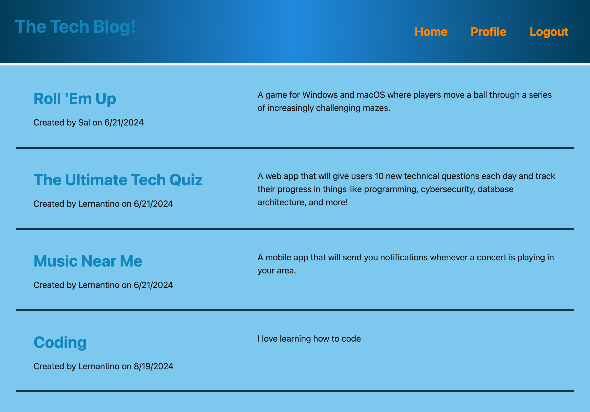

# Developer Blog CMS

## Description
This project is a CMS-style blog site built for developers to publish their blog posts and comment on others' posts. The site is designed to follow the MVC (Model-View-Controller) paradigm and includes features such as user authentication, post creation, and commenting.

## Technologies Used
- **Handlebars.js**: Templating language for rendering the views.
- **Sequelize**: ORM (Object-Relational Mapping) to interact with the MySQL database.
- **Express.js**: Web application framework for building the backend.
- **Express-Session**: Middleware for handling user sessions and authentication.
- **MySQL2**: Database for storing user data, posts, and comments.
- **bcrypt**: Library for hashing passwords.
- **Dotenv**: Module for loading environment variables from a `.env` file.
- **Render**: Platform for deploying the application.

## Features
- **User Authentication**: Users can sign up, log in, and log out securely.
- **Post Creation**: Authenticated users can create new blog posts.
- **Commenting**: Users can comment on blog posts.
- **MVC Architecture**: The application is structured following the MVC paradigm.

## Endpoints

### User Authentication
- `POST /api/users/login`: Logs in an existing user.
- `POST /api/users/logout`: Logs out the current user.
- `POST /api/users/signup`: Registers a new user.

### Blog Posts
- `GET /api/posts`: Retrieves all blog posts.
- `GET /api/posts/:id`: Retrieves a single blog post by its ID.
- `POST /api/posts`: Creates a new blog post (authentication required).
- `PUT /api/posts/:id`: Updates an existing blog post by its ID (authentication required).
- `DELETE /api/posts/:id`: Deletes a blog post by its ID (authentication required).

### Comments
- `GET /api/comments`: Retrieves all comments.
- `POST /api/comments`: Creates a new comment on a blog post (authentication required).

[Visit the Blog Site](https://danie1nunez.github.io/techBlog/)
